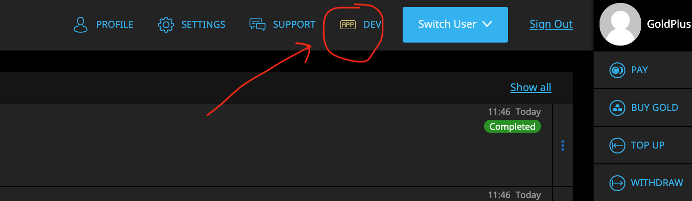

# Building your own applications

First of all, you need to create your own application and to receive a pair app\_id/app\_secret. This pair will be used
to generate an OAuth2 token to authenticate your users (see [Authentication](../authentication.md) ).

To start you should perform registration as a user on the Copernicus Gold web application 
(for testing we use https://testwebnew.copernicusgold.com ) and add a company in it, because all applications
must be linked to a corporate entity.

After completion the registration, you can see the DEV sub-menu item in the header menu of the web application, see the picture below:

The DEV menu contains the information about the applications you company owns. Using the functionality provided there,
you can create a new application, modify existing ones (i.e. set the app_secret value) and also remove the unused anymore.

There is a way to manage your applications through API, for details, please see [Applications](./applications.md)
